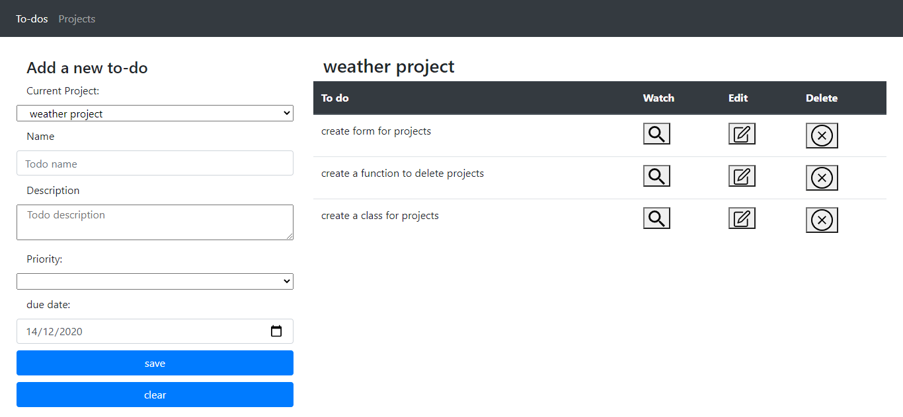

# to-do list Project

Third JavaScript Microverse Project By Oscar Russi

# What it does

- The website was built with JavaScript and Webpack
- The page let user to create to-dos for different projects
- Index page contains 2 tabs, the first one let you add new to-dos to any project
- First tabs also shows a list of to-dos for the selected project
- User can watch, edit or delete a project
- Second tab is to create new projects
- Second tab has a similar structure of the first one, a form to add projects and a table with all the projects.
- You can also watch, edit and delete projects.
- The project has the next folders: load, logic, data and classes 
- The load folder contains the modules to edit the DOM
- The logic folder contains the functions to work with the data
- data folder contains the projects, to-dos and the icons
- classes folder contains the todo class and project class

# Build with

- HTML5/CSS
- JavaScript
- Webpack
- Bootstrap

# Live demo

[Live Demo](https://andresporras3423.github.io/todo-list/dist/index.html)

# How to run this project

- Download this project or install running the next command in the terminal: git clone https://github.com/andresporras3423/todo-list.git 
- Move to the folder todo-list
- In the terminal, run: npx webpack
- Open in a browser the index.html file

#### and deployed to GitHub

## Authors

**Oscar Russi**
- Github: [@andresporras3423](https://github.com/andresporras3423/)
- Linkedin: [Oscar Russi](https://www.linkedin.com/in/oscar-andres-russi-porras)

## � Contributing

This is a project for educational purposes only. We are not accepting contributions.

## Attributions and Credit

Special thanks to Microverse, for this learning opportunity. 

## Show your support

Give a ⭐️ if you like this project!

## Enjoy!